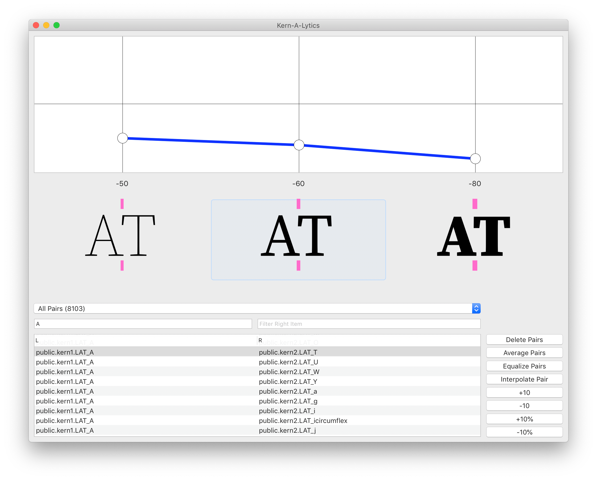

⚠️ WARNING: This extension works, but it’s work in progress. 
It may not do what you expect. Back up your data. ⚠️ 

# Kern-A-Lytics v0.1

This extension helps analyzing and fixing the consistency of kerning across several master UFOs.  

## UI Elements

#### Graph

The interactive graph is the main point of this extension.
It visualizes the values of a kerning pair across a number of masters.
Sliders can be dragged up and down (currently capped to 500/-500).
A double-click on a slider will delete that kerning pair for that specific master.

#### List

The list contains all combined kerning pairs for all open UFOs.

#### List Filter

The list filter contains various pre-set filtering options to look into the 
kerning based on a specific factor. I found this selection useful, but it may not be exhaustive at all.
such as a list of exceptions, single pairs, very large kerning pairs, etc.

#### Buttons

`Delete Pairs`: Delete current pair across all UFOs  
`Average Pairs`: Set all pairs to their average value  
`Equalize Pairs`: Set all pairs to be the same value as the currently selected UFO  
`Interpolate Pair`: Interpolate selected pair(s)  
`+/- 10`: Increase/decrease all selected pairs by 10 units  
`+/- 10%`: These buttons are silly and not hooked up  

---

## Problems

Currently, masters are sorted by Robofont’s `AllFonts('styleName')` functionality.
Obviously, this is not the smartest way, but it shall work for version 0.1

Re-sizing of the window is possible, but there are some problems with the canvas, 
and the list & buttons are not hooked up to the re-size operation. I don’t know 
how to fix the former, the latter will be fixed very soon.

## Note

Kern-A-Lytics is only compatible with Robofont 3.

